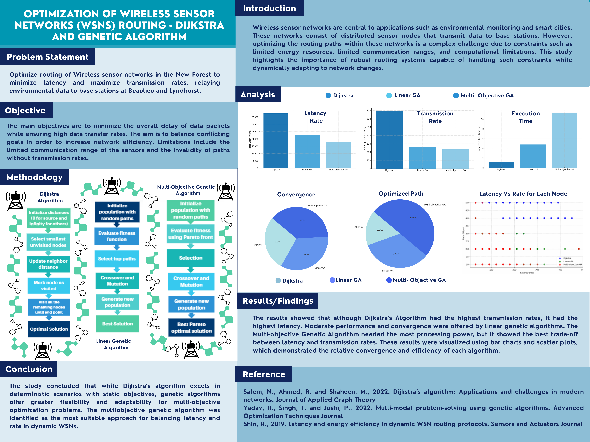

# Vehicle Route Optimization
# Multi-Objective Routing Optimisation in Wireless Sensor Networks (WSNs)

This repository presents a project focused on optimising routing paths in Wireless Sensor Networks using both deterministic and evolutionary algorithms. The system is tested on simulated sensor placements in the New Forest designed to monitor environmental parameters and route data to base stations efficiently.

--- 

## Project Overview

The objective is to find optimal routing paths that:
- Minimise **end-to-end latency**
- Maximise **end-to-end transmission rate**
- Respect communication range constraints

---

### Algorithms Compared:
1. **Dijkstra’s Algorithm**  
   - Deterministic, single-objective approach
   - Uses linear combination of latency and transmission rate
2. **Genetic Algorithm (Linear)**  
   - Evolves solutions using a fitness function with combined score
3. **Genetic Algorithm (Pareto)**  
   - Uses Pareto front sorting for multi-objective optimisation

---

## Problem Statement

Given a network of sensor nodes with known (x, y) positions:
- Sensors transmit to one of two base stations (Beaulieu or Lyndhurst)
- Many sensors require multi-hop routing
- The optimisation aims to improve latency and throughput across the network

---

## Key Features

- Distance-based transmission rate calculation
- Graph generation with constraints on invalid links
- Fitness and cost functions for rate and latency
- Multi-run evaluations for robustness
- Rich visualisations and convergence plots

---

### Project Poster

---

### Tools
- Google Colab
- Datset (sub_data_file.csv)
- Canva

